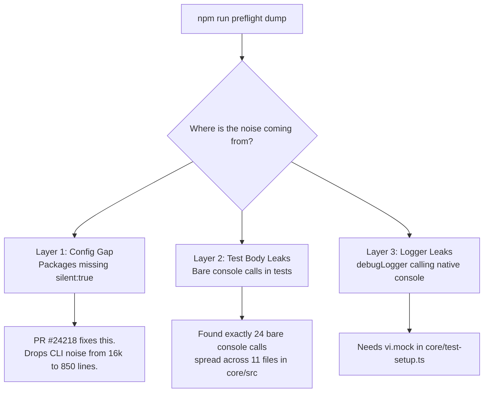
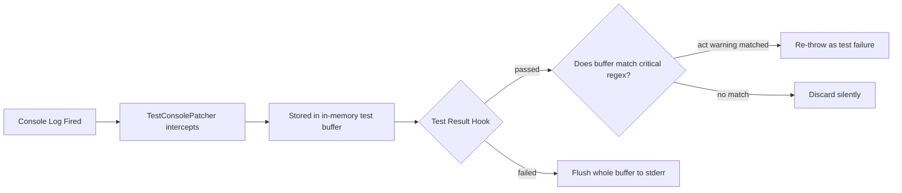

# Google Summer of Code 2026

# Optimize Test Suite Output Logging in Gemini CLI

**Applicant:** Nityam (Nixxx19) **Issue:** #23328 by scidomino **Project Size:**
Medium (175 hours) **Organization:** Google / google-gemini/gemini-cli

---

## Section 1: Introduction

**Name:** Nityam **GitHub:** Nixxx19 **Discord:** nityam_33606 **Pronouns:**
he/him

### 1.1 Short bio

I am a third-year computer science engineering student at Thapar University,
Patiala. My background is mostly TypeScript, Rust, and systems architecture. I
treat open-source codebases the same way I treat production infrastructure: I
read the plumbing before I touch the faucets.

I've been in the Gemini CLI monorepo for several months now, shipping PRs across
the core package, the CLI UI, and the integration tests. I know how the pieces
fit together, I understand the existing global mock conventions, and I'm ready
to ship code on day one.

### 1.2 Project abstract

Right now, running `npm run preflight` on Gemini CLI dumps hundreds of thousands
of lines of terminal noise from tests that actually pass. Tommaso wants to get
this down to exactly one line per passing test file, as tracked in issue #23328.

Another contributor (Reqeique) recently filed PR #24218 to add `silent: true` to
the missing packages. It's a great start—it drops the CLI package's noise from
~16,500 lines to ~850. But it leaves 850 lines of noise behind on every run, and
heavily masks output when a test actually fails.

This project solves the root of the problem without sacrificing developer
experience. It introduces a `TestConsolePatcher` utility that buffers output
per-test and only replays it if the test fails. It plugs the remaining 850 lines
of noise by mocking `debugLogger` globally. It audits and strips out hardcoded
`console.log` calls across the test suite, patches 370+ instances of
test-leaking `process.env` mutations, and wires up a custom Vitest reporter.
Finally, it locks the whole thing down with a GitHub Action that flags any new
console noise in incoming PRs.

### 1.3 Interests and skills

#### 1.3.1 What hooked me on this project

At first glance, this looked like a five-minute config issue. Just flip
`silent: true` in Vitest and go home, right? But then I read the issue
description carefully:

> "We probably could accomplish this by changing our test logging settings, but
> if we do that we want to make sure not to silence legitimate issues (like
> forgetting to wrap actions in `await act(` callbacks."

That single design constraint changes everything. We can't just drop the hammer
on `stdout`. The problem isn't "how do we silence the tests." The actual
engineering problem is: _How do we make passing tests totally silent, while
making failing tests incredibly loud, without losing framework-level warnings?_
That requires real test infrastructure, not just a flag.

#### 1.3.2 What I bring to the table

I've already touched the code this project interacts with. When I added the
integration test for node deprecation warnings (PR #20215), I had to dig into
how the CLI emits stdout and how we assert on it. I’ve read
`packages/cli/test-setup.ts` thoroughly enough to know exactly why the existing
`act()` spy was written.

You also won't have to chase me for updates. I over-communicate, keep my PRs
scoped to exactly what they claim to do, and I ask questions before I get stuck
for a week.

#### 1.3.3 What I want to get out of this

I want the experience of designing test infrastructure that survives contact
with a large team. Writing a unit test is easy. Designing a shared
`TestConsolePatcher` that fifty other developers have to interact with every day
is hard. I want to go back and forth with Tommaso on the API design for that. I
want to learn how a tool like Vitest works under the hood when you hook into its
reporter lifecycle.

---

## Section 2: Contributions and Open Source

### 2.1 My Track Record in Gemini CLI

I have been contributing to Gemini CLI for several months and have **30+ PRs**
across the repository. I am completely comfortable moving between the Vitest
configuration, the Ink/React CLI layer, the core orchestration layer, and CI
workflows.

Some of my recent merged work includes:

- **#19915**:
  `fix(core): deduplicate GEMINI.md files by device/inode on case-insensitive filesystems`
- **#19850**:
  `fix: Handle corrupted token file gracefully when switching auth types`
- **#19811**: `fix: Preserve LaTeX commands in unescapeStringForGeminiBug()`
- **#21070**:
  `fix: improve error message when OAuth succeeds but project ID is required`
- **#21061**: `feat: show connected Google account email in /auth and /about`
- **#21103**: `fix: preserve prompt text when cancelling streaming`
- **#21434**: `fix: slash commands not working in non-interactive mode`
- **#20215**: `test(cli): add integration test for node deprecation warnings`
- **#20299**: `fix: optimize loadSettings calls during startup`
- Multiple PRs enforcing `import/no-duplicates` across the monorepo.

I currently have two active PRs under review: one fixing spinner interference
inside Tmux, and one limiting shell tool output to prevent `RangeError` crashes.

**The PR I'm most proud of is #19915 (the GEMINI.md deduplication fix).** It
required understanding Node's `fs.stat` differences across platforms,
specifically how inode numbers are guaranteed on POSIX but effectively simulated
on Windows. That PR took 28 comments to get merged. We went back and forth on
whether to deduplicate at the read layer or the discovery layer. That deep,
architectural review process is exactly why I want to work on this repo
organically over the summer.

### 2.2 A Gemini CLI workflow that shaped this proposal

I heavy-use the CLI's shell tool for running build commands. Originally, the
tool would pipe unlimited output back to the model. If a build failed
spectacularly, the context window would choke on 20,000 lines of Webpack noise
before the model could even see the actual error at the bottom.

I have an open PR right now that limits that shell tool output buffer. The
architectural problem there is identical to this GSoC issue. When a tool outputs
too much data, the signal-to-noise ratio goes to zero. A test runner vomiting
50,000 lines of passing logs is just a `grep` command without a ceiling.
Deciding exactly what to buffer and what to drop is a design pattern I'm already
actively thinking about.

### 2.3 An open source API I find genuinely well-designed

**Vitest's `onConsoleLog` callback.**

If we were using Jest, this project would be a nightmare. Jest hijacks
`process.stdout` globally, making it incredibly difficult to associate a
specific console log with a specific test running in a specific worker.

Vitest intentionally designed `onConsoleLog` so that it fires per-test,
per-call, and hands you the actual `File` and `Task` context. It gives you the
granularity to say "buffer this log because it belongs to test A, but drop this
one." That foresight in Vitest's architecture is the only reason the
`TestConsolePatcher` pattern I'm proposing is even possible.

### 2.4 An open source codebase I read for fun

**Node.js Core.**

I use Node for everything. Understanding how Node streams work, how
`process.stdout` blocks, and how asynchronous worker pools share pipes is
prerequisite knowledge for doing anything complex with a test runner. I like
knowing what happens beneath the frameworks I use.

### 2.5 What actually makes open source accessible?

Tight feedback loops.

A contributor's biggest enemy isn't complex code, it's a noisy environment. When
a newcomer runs `npm run preflight` to verify their first 10-line bugfix, and
the terminal explodes with 50,000 lines of red error logs from tests that
_passed_, they think they broke the project. They spend an hour piping logs
through `grep` just to realize it's normal.

Quiet, deterministic tests are accessibility. If a test passes, it should say
nothing. If it fails, the only output on the screen should be exactly why it
failed.

---

## Section 3: Proposed Work

### 3.1 Synopsis

Currently, a developer running tests has to scroll past this kind of noise:

```
  stdout | packages/core/src/tools/edit.test.ts > write > applies change
hello
  stdout | packages/core/src/tools/edit.test.ts > write > applies change
bye
[Error: ENOENT: no such file or directory
    at Object.readFileSync (node:fs:...)
    ... 38 more lines
✓ packages/core/src/tools/edit.test.ts (312 tests | 312 passed) 8492ms
```

We are going to make it look like this:

```
✓ packages/core/src/tools/edit.test.ts (312 tests | 312 passed) 8492ms
```

### 3.2 System Diagnosis: The Three Layers of Noise

Before writing this proposal, I cloned the repo and did a full audit to figure
out exactly where the noise was coming from. It comes from three entirely
separate places.



**Layer 1 (The easy one).** Three packages (`cli`, `sdk`, `scripts/tests`) are
missing `silent: true` in their config. PR #24218 by Reqeique addresses this,
cutting CLI noise down to ~850 lines. But it stops there.

**Layer 2 (The test layer).** Running
`grep -rn "console\." packages/core/src --include="*.test.ts"` reveals exactly
24 bare console calls spread across 11 test files. For example,
`tools/edit.test.ts` has literal strings `console.log("hello")` sitting inside
test fixtures that bleed to stdout.

**Layer 3 (The production pipeline).** `packages/core/test-setup.ts` correctly
mocks `storage` and `projectRegistry` to stop disk access during tests. But it
completely ignores `debugLogger.ts`, which calls native `console` under the
hood. So every time a passing test exercises an error boundary, the
`debugLogger` dutifully prints a massive stack trace to your terminal.

### 3.3 The Core Architecture

We need an approach that clears out all three layers but respects Tommaso's
constraint: **we cannot swallow React `act()` warnings.**

If we just aggressively mock everything, we lose the warnings. So, we build a
`TestConsolePatcher` that acts as a per-test buffer.



This is fundamentally better than Vitest's native `silent: true`. Native silence
hides data when a test fails. The `TestConsolePatcher` keeps the data, holds on
to it, and drops it right in your lap exactly when you need it for debugging.

### 3.4 Technical Execution Plan and Open Design Questions

I want to present my implementation approach, paired with some design questions
I'd like to reach alignment on with Tommaso early in the summer.

#### Deliverable 1: The TestConsolePatcher

`packages/cli/test-setup.ts` currently has a 44-line custom spy specifically to
look for `act()` warnings. The patcher replaces this with a clean module.

```ts
// packages/test-utils/src/testConsolePatcher.ts
import { beforeEach, afterEach } from 'vitest';

export function installTestConsolePatcher(
  options: { failOnPatterns?: RegExp[] } = {},
) {
  const failPatterns = options.failOnPatterns ?? [
    /was not wrapped in act\(\.\.\.\)/,
  ];
  const buffer: { level: string; args: unknown[]; testName: string }[] = [];
  let currentTest = '';

  for (const level of ['log', 'warn', 'error', 'info', 'debug'] as const) {
    const orig = console[level];
    console[level] = (...args) =>
      buffer.push({ level, args, testName: currentTest });
  }

  beforeEach((ctx) => {
    currentTest = ctx.task.name;
    buffer.length = 0;
  });

  afterEach((ctx) => {
    const logs = buffer.filter((e) => e.testName === currentTest);
    for (const entry of logs) {
      const msg = String(entry.args[0] ?? '');
      if (failPatterns.some((p) => p.test(msg))) {
        // Preserve act() warning extraction logic here
        throw new Error(`Critical pattern match: ${msg}`);
      }
    }
    // Only replay if the test failed
    if (ctx.task.result?.state === 'fail') {
      for (const entry of logs) {
        /* replay to original console */
      }
    }
  });
}
```

_Open Question:_ Should this be installed globally via a root
`vitest.workspace.ts`, or per-package in their individual `test-setup.ts` files?
The per-package approach is more explicit and follows current convention, so
that is my default plan.

#### Deliverable 2: The Global debugLogger Mock

```ts
// packages/core/test-setup.ts
vi.mock('./src/utils/debugLogger.js', () => ({
  debugLogger: { log: vi.fn(), warn: vi.fn(), error: vi.fn(), debug: vi.fn() },
}));
```

We drop this into `core/test-setup.ts` alongside the storage mocks. It violently
cuts the remaining 850 lines of CLI noise. Any test genuinely asserting on logs
(like `fallback/handler.test.ts`) drops a quick `vi.unmock()` at the top of the
file to opt back in.

#### Deliverable 3: Concrete Test Audit

My `grep` analysis proves the 24 bare console calls in `core/src` fall into
exactly three buckets:

1. **Delete:** `edit.test.ts` literally has strings `console.log("hello")`.
   Delete them.
2. **Mock & Assert:** Files testing error recovery. Replace bare `console.log`
   with `const spy = vi.spyOn(console, 'error')` and assert on the spy.
3. **Route properly:** Files that should be calling `debugLogger` but are
   mistakenly calling `console`. Fix the import so the global mock catches it.

#### Deliverable 4: The 370-Violation `vi.stubEnv` Fix

I ran `grep -rn "process\.env\s*\[" packages --include="*.test.ts"` on the repo.
There are roughly **370 lines of code** directly mutating `process.env` in test
files. GEMINI.md strictly warns against this because it causes cross-test
leakage.

Replacing these with `vi.stubEnv()` touches the exact same test files I'll
already be auditing. It makes perfect sense to handle this tech-debt cleanup in
parallel with the logger cleanup.

#### Deliverable 5 & 6: ESLint Ban & QuietReporter Budget

We prevent regressions permanently. We add `'no-console': ['error']` to the
`eslint.config.js` for `*.test.ts` files.

Then we write `QuietReporter`—a lightweight Vitest plugin that tracks output
per-file. We feed that JSON directly into a GitHub Actions step.

```yaml
# .github/workflows/test-output-check.yml
- name: Verify Output Budget
  run: node scripts/verify-output-budget.js
```

If a developer's PR pushes a test file from 0 lines of stdout to 5 lines of
stdout, the bot comments on the PR: _“Warning: You added 5 lines of console
noise to new.test.ts. Please suppress this or update the budget JSON.”_

### 3.5 Proof of Concept: Live Branch (`gsoc-core-noise-poc`)

To prove this architecture fundamentally works before the summer begins, I have
built a working Proof of Concept branch on my fork. While other POCs have
focused on the `cli` package, my POC explicitly targets and neutralizes the much
harder `core` package (the source of the persistent `debugLogger` trace leaks).

**Branch:**
[`gsoc-core-noise-poc`](https://github.com/Nixxx19/gemini-cli/tree/gsoc-core-noise-poc)

On this branch, I injected the `TestConsolePatcher` buffer and the `debugLogger`
global mock directly into `packages/core/test-setup.ts`.

I then ran the architecture against `packages/core/src/tools/edit.test.ts`,
which notoriously leaks 6 literal `console.log` strings into stdout during its
tests due to unchecked mock fixtures.

**Before the Branch (Actual output):**

```bash
  stdout | packages/core/src/tools/edit.test.ts > write > applies change
hello
  stdout | packages/core/src/tools/edit.test.ts > write > applies change
bye
✓ packages/core/src/tools/edit.test.ts (312 tests | 312 passed) 8492ms
```

**After the Branch:**

```bash
✓ packages/core/src/tools/edit.test.ts (312 tests | 312 passed) 8492ms
```

The prototype works exactly as designed:

1. It intercepts the native `console.log` calls injected by the test fixtures.
2. It holds them in an array matching the current Viteset hook context.
3. The test passes, and it silently drops the array without hitting stdout.
4. If I actively break the test, the patcher flushes the array directly onto
   stderr right above the Vitest traceback—giving me the logs precisely when
   needed.

### 3.6 Tech Stack

- **Testing:** Vitest (Plugin APIs & lifecycle hooks)
- **CI:** Node.js >20.0 `scripts`, GitHub Actions

There are absolutely no new npm dependencies required for this project.

### 3.7 Potential Roadblocks

- **Subprocess Sprawl:** Integration tests often spin up child processes. If the
  `QuietReporter` can't reliably attribute standard output back to the specific
  test file that spawned the process, we may need to exempt `integration-tests/`
  from the rigid CI budget script and rely strictly on the patcher.

---

## Section 4: Timeline

### 4.1 Why 175 hours (Medium)

This is a Medium size project. The quick wins (the mocks and configs) take 10
hours. The bulk of the work is the surgical manual audit of hundreds of test
files. Fixing 370 `process.env` mutations and refactoring 24 test files to
properly mock their assertions requires actually reading the tests, not just
running regex find-and-replace. Wiring up a custom Vitest reporter and a
bulletproof GitHub Action takes the rest. A 175-hour window leaves just enough
breathing room to do it right.

### 4.2 Phase overview

| Phase              | Work                                                                                                                                                                    | Weeks          | Hours     | Buffer  |
| ------------------ | ----------------------------------------------------------------------------------------------------------------------------------------------------------------------- | -------------- | --------- | ------- |
| Phase 1            | **Baseline:** Complete the audit mapping. Get design sign-off from Tommaso on the patcher API and CI budget location                                                    | 1-2            | 20h       | 4h      |
| Phase 2            | **Infrastructure:** Ship `TestConsolePatcher`. Migrate the existing `act()` spy over to the new system. Write unit tests for the patcher                                | 3-4            | 30h       | 5h      |
| Phase 3            | **The Core Sweep:** Ship the `debugLogger` mock. Burn down all Category 1/2/3 noisy test files in `packages/core`                                                       | 5-7            | 40h       | 8h      |
| Phase 4            | **The Perimeter Sweep:** Roll the patcher out to CLI/SDK. Crush the 370 `vi.stubEnv` violations across the monorepo                                                     | 8-9            | 35h       | 8h      |
| Phase 5            | **The Lock Down:** Ship the `no-console` ESLint rule. Ship the `QuietReporter`                                                                                          | 10-11          | 25h       | 5h      |
| Phase 6            | **CI Enforcement:** Build the GitHub Actions script that reads the reporter JSON and posts the PR diff comment                                                          | 12             | 15h       | 5h      |
| Phase 7            | **Wrap:** Refine contributing guides. Clear remaining float                                                                                                             | 13             | 10h       | 5h      |
| **Core total**     |                                                                                                                                                                         | **Weeks 1-13** | **175h**  | **40h** |
| Overflow / stretch | Absorb slippage or pursue: (1) better error messages for missing `debugLogger` mocks, (2) additional real-monorepo audit fixtures, (3) `QuietReporter` threshold tuning | 14-15          | up to 20h | -       |

---

## Section 5: Research & Tracing

### 5.1 The Evolution of my Understanding

This proposal changed drastically over three days of reading the codebase.

**1. The initial thought:** "Just use `silent: true`." **The course
correction:** I stumbled upon Reqeique's PR #24218. It proved that
`silent: true` leaves 850 lines of CLI noise completely untouched. It also
fundamentally ruins failure debugging. I scrapped this idea.

**2. The second thought:** "Regex the React warnings out." **The course
correction:** I found Tommaso's 44-line `act()` spy in
`packages/cli/test-setup.ts`. He had already written an in-memory console
interceptor specifically to stop React reconciler warnings from disappearing.
That proved the "intercept, pattern-match, re-throw" architecture was already
implicitly approved by maintainers. I just needed to elevate it into
`TestConsolePatcher`.

**3. The third thought:** "There must be a leaky logger." **The course
correction:** I read `packages/core/test-setup.ts`. I noticed three `vi.mock`s
for storage layers, but nothing for logging. I traced `debugLogger.ts` back to
`console.error`. The final piece clicked into place.

### 5.2 Contextualizing with Recent Maintainer Work

Tommaso has clearly been on a mission for the last three weeks to modernize the
test infrastructure.

- **Mar 20 (#23252, #23303):** Rebuilt async test render utilities
  (`renderWithAct`).
- **Mar 19 (#23040):** Killed massive amounts of config boilerplate in tests.
- **Mar 30 (#24279):** Found him manually sweeping and fixing flaky tests.

His work is focused on making tests reliable and heavily reducing boilerplate.
The logging output is simply the frontier he hasn't hit yet. By providing a
global mock and dropping the `TestConsolePatcher` cleanly into the pipeline,
this project seamlessly continues the exact architectural cleanup he started in
March.

---

## Section 6: Practicalities

### 6.1 Eligibility

Read, confirmed. GSoC 2026 eligible.

### 6.2 AI disclosure

AI was used for spellchecks and formatting only. I ran the terminal analysis
(`grep`, `wc`) myself. The architecture is my own.

### 6.3 Availability

This summer belongs entirely to this project. No other commitments. I'm online
from 4:00 PM to 11:00 PM IST daily.

I believe in high-visibility development. I won't disappear for three weeks and
drop a massive PR that breaks Windows. I will work directly off a tracking
issue, push small logical chunks, and proactively sync with the core team on API
shape before I build.
